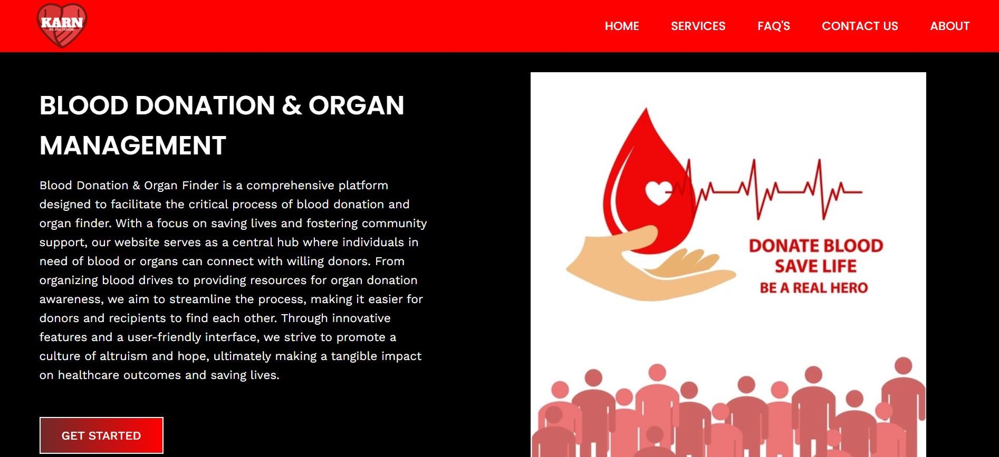
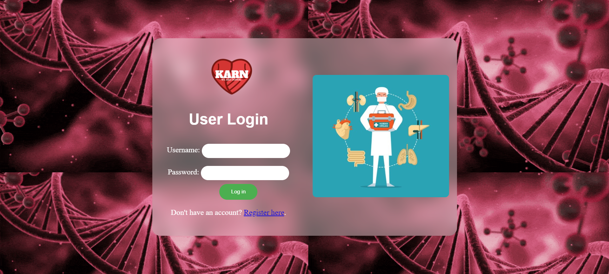

## Introduction
Karn-Flask-BloodBank-and-Organ-Management is a web application built using Flask, designed to manage blood bank inventories and organ donation processes efficiently. The system provides a user-friendly interface for both donors and administrators to interact with the database.

## Features
- **User Management**: Authentication and authorization for donors and administrators.
- **Blood Bank Management**: Add, update, and remove blood bank details, including inventory.
- **Organ Donation Management**: Track organ donations, donors, and recipients.
- **Search Functionality**: Enables users to search for blood banks and available organs.
- **Admin Dashboard**: Provides administrators with insights into system activities and statistics.
- 
## Installation
Clone the repository:
   ```bash
   git clone https://github.com/zeusgodyt/Karn-Flask-BloodBank-and-Organ-Management.git
````
Run the Application:
````
python myapp1.py
````


